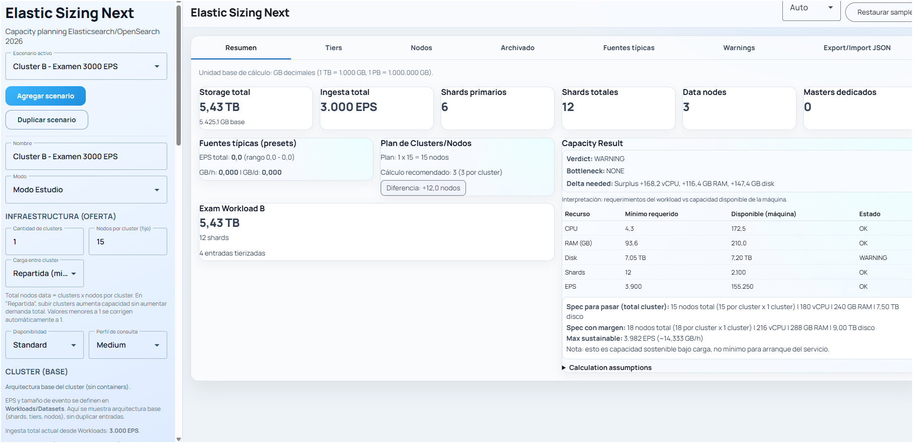

# Elastic Sizing Next

> Herramienta open-source para capacity planning de clusters **Elasticsearch / OpenSearch**, con soporte de ILM por tiers (`hot/warm/cold/frozen`), escenarios comparables y export/import JSON.


---

## 🆓 Uso libre

Este proyecto es de **uso libre**. Puedes usarlo, copiarlo, modificarlo y distribuirlo sin restricciones bajo la licencia MIT. No se requiere atribución obligatoria, aunque siempre es bienvenida.

## 🤝 Contribuciones y sugerencias

¡Las contribuciones son bienvenidas! Si encontrás un bug, querés proponer una mejora o simplemente compartir una idea:

- Abrí un [Issue](https://github.com/cdc-netics/elastic-size/issues) con tu sugerencia o reporte.
- Hacé un fork del repo, aplicá tus cambios y enviá un [Pull Request](https://github.com/cdc-netics/elastic-size/pulls).
- Si tenés dudas sobre la arquitectura o el motor de cálculo, abrí una [Discussion](https://github.com/cdc-netics/elastic-size/discussions).

Toda ayuda suma 🙌

---

## Stack y decisiones

| Capa | Tecnología |
|---|---|
| Frontend | Angular 20, standalone components, signals, Angular Material |
| Estado | Signals puros (`signal`, `computed`, `effect`) — sin NgRx |
| Backend | No incluido — cálculo 100% local en navegador |
| Persistencia | `localStorage` + export/import JSON |

## Modos

| Modo | Descripción |
|---|---|
| `study` | Cálculo rápido tipo calculadora |
| `production` | Mismo motor + validaciones estrictas (e.g. warning si no hay hot tier con datos) |

## Modelo principal

- **`ScenarioInput`** — escenario completo (modo, overhead, constraints, nodeProfiles, workloads)
- **`WorkloadInput`** — caso de uso/cliente con uno o más datasets
- **`DatasetInput`** — ingest + políticas ILM por tier
- **`SizingResult`** — resultado final con resumen global, vista por tier, warnings y plan de nodos

Modelos en `src/app/core/models/sizing.models.ts`.



---

## Motor de cálculo (puro y testeable)

Ubicación: `src/app/core/engine`

### Funciones principales

- `normalizeInputs`
- `calculateStorageByTier`
- `calculatePrimaryShardsByTier`
- `calculateTotalShardsByTier`
- `recommendNodesByTier_storageBased`
- `recommendNodesByTier_shardsHeapBased`
- `recommendMasters`
- `generateWarnings`
- `optional_assignShardsToNodes`
- `calculate`

### Fórmulas clave

**Conversión:**
```
gb_per_day         = gb_per_hour * 24
bytes_per_sec      = (gb_per_hour * 1e9) / 3600
eps                = bytes_per_sec / avg_event_bytes
```

**Storage por tier:**
```
primary_storage_gb = daily_gb * retention_days * index_overhead_factor * headroom_factor
total_storage_gb   = primary_storage_gb * (1 + replicas)
```

**Shards:**
```
primary_shards = max( ceil(primary_storage_gb / target_shard_size_gb),
                      ceil(retention_days / rollover_days) )
total_shards   = primary_shards * (1 + replicas)
```

**Nodos por tier:**
```
nodes_by_storage    = ceil(total_storage_gb / (node_disk_gb * disk_usable_factor))
nodes_by_shards_heap = ceil(total_shards / (heap_gb * max_shards_per_node_per_heap_gb))
nodes_recommended   = max(nodes_by_storage, nodes_by_shards_heap, min_data_nodes_per_tier)
```

**Masters dedicados:**  
Si `total_data_nodes > require_dedicated_masters_when_data_nodes_gt`, recomienda `dedicated_masters` (mínimo 3).

---

## Warnings implementados

- ⚠️ Tamaño promedio de shard fuera de rango recomendado
- ⚠️ Oversharding
- ⚠️ Tier limitado por shards/heap
- ⚠️ Aplicación de mínimo de nodos HA
- ⚠️ Recomendación de masters dedicados
- ❌ Errores de input (e.g. EPS sin `avg_event_bytes`)

---

## UI

Layout implementado:

- **Sidebar izquierda**: escenarios, workloads, datasets, presets y configuración
- **Main tabs**:
  - `Resumen`
  - `Tiers`
  - `Nodos`
  - `Warnings`
  - `Export/Import JSON`

Salidas visuales en cards/chips (no tablas estilo spreadsheet).

---

## Inicio rápido

```bash
# Instalar dependencias
npm install

# Servidor de desarrollo
npm start

# Build producción
npm run build

# Tests unitarios
npm run test -- --watch=false
```

## Tests

Pruebas unitarias del motor en `src/app/core/engine/calculate.spec.ts`.

Cubre: conversiones, sizing por tier, masters dedicados y regla de colocación primario/réplica.

## Archivo de ejemplo

`public/config.sample.json` — incluye 2 escenarios reales con múltiples workloads y datasets.

---

## Licencia

MIT © [cdc-netics](https://github.com/cdc-netics)
